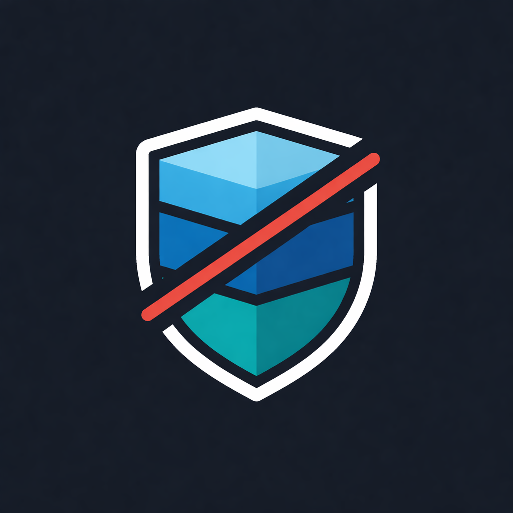

# CLinicius

<p align="center">
  
</p>

> Architectural governance CLI for Go projects.

CLinicius enforces layer boundaries and detects cyclic dependencies in Go codebases — the things most linters quietly ignore.

```bash
clinicius check ./...
```

```
❌ Architectural Violation
  Layer:   handler
  Package: myapp/internal/handler
  Imports: myapp/internal/repository
  Rule:    layer-boundary
  Detail:  handler layer cannot depend on internal/repository

1 violation found.
```

---

## Installation

### Prerequisites

Go 1.22+ must be installed. Download at [go.dev/dl](https://go.dev/dl).

### Build from source

```bash
git clone https://github.com/vtbarreto/CLinicius.git
cd CLinicius
go build -o clinicius .
```

Then move the binary to a directory in your `$PATH` (see below).

---

### Adding the binary to your PATH

#### Linux and macOS

Move the binary to `/usr/local/bin` (requires sudo):

```bash
sudo mv clinicius /usr/local/bin/
```

Or install directly into your Go bin directory (no sudo needed):

```bash
go build -o ~/go/bin/clinicius .
```

Then make sure `~/go/bin` is in your PATH. Add this line to `~/.bashrc` (bash) or `~/.zshrc` (zsh):

```bash
export PATH="$PATH:$HOME/go/bin"
```

Reload the shell:

```bash
source ~/.bashrc   # or source ~/.zshrc
```

Verify:

```bash
clinicius --help
```

#### Windows

Build the binary:

```powershell
go build -o clinicius.exe .
```

Move it to a permanent location, for example `C:\tools\`:

```powershell
mkdir C:\tools
move clinicius.exe C:\tools\
```

Add `C:\tools` to your system PATH:

1. Open **Start** → search for **"Environment Variables"**
2. Click **"Edit the system environment variables"**
3. Click **Environment Variables...**
4. Under **System variables**, select **Path** and click **Edit**
5. Click **New** and add `C:\tools`
6. Click **OK** on all dialogs

Open a new terminal and verify:

```powershell
clinicius --help
```

---

## Usage

### `clinicius init` — generate config automatically

Run this first in any Go project. CLinicius scans the directory tree, detects layer folders by name and generates a `clinicius.yaml` with the right rules already set:

```bash
clinicius init
```

```
✅ Generated clinicius.yaml with 4 layer(s) detected:

  handler       internal/handler
                forbids: internal/repository
                forbids: internal/infra
  domain        internal/domain
                forbids: internal/infra
                forbids: internal/repository
                forbids: internal/handler
  repository    internal/repository
                forbids: internal/handler
  infra         internal/infra

--------------------------------------------------
Review the generated file, then run:
  clinicius check ./...
```

Recognized folder names:

| Layer type | Folder names |
|---|---|
| handler | `handler`, `handlers`, `controller`, `controllers`, `http`, `rest`, `grpc`, `api` |
| domain | `domain`, `core`, `model`, `entity`, `entities` |
| usecase | `usecase`, `usecases`, `service`, `services`, `application` |
| repository | `repository`, `repositories`, `repo`, `store`, `storage` |
| infra | `infra`, `infrastructure`, `database`, `db`, `cache`, `queue` |

Additional flags:

```bash
clinicius init --dry-run                     # preview without writing
clinicius init --output configs/rules.yaml   # custom output path
clinicius init --force                       # overwrite existing file
```

---

### `clinicius check` — run the analysis

```bash
# Check all packages in the current module
clinicius check ./...

# Use a custom config file
clinicius check ./... --config path/to/clinicius.yaml

# CI mode: exits with code 1 if violations are found
clinicius check ./... --ci

# JSON output for tooling integration
clinicius check ./... --json
```

### `--lang` — output language

CLinicius auto-detects your language from the OS locale (`LANG` env var). You can override it with a flag or environment variable:

```bash
# Via flag (highest priority)
clinicius --lang=pt-BR check ./...

# Via environment variable (current session only)
CLINICIUS_LANG=pt-BR clinicius check ./...

# Auto-detected from OS (e.g. LANG=pt_BR.UTF-8)
clinicius check ./...
```

To set `CLINICIUS_LANG` permanently:

**Linux / macOS** — add to `~/.bashrc` or `~/.zshrc`:
```bash
export CLINICIUS_LANG=pt-BR
```
Then reload: `source ~/.bashrc`

**Windows** (PowerShell):
```powershell
[System.Environment]::SetEnvironmentVariable("CLINICIUS_LANG", "pt-BR", "User")
```

To check what language your OS is reporting:
```bash
echo $LANG   # e.g. pt_BR.UTF-8 → CLinicius uses pt-BR automatically
```

Example output in pt-BR:

```
❌ Violação Arquitetural
  Camada:  handler
  Pacote:  myapp/internal/handler
  Importa: myapp/internal/repository
  Regra:   layer-boundary
  Detalhe: handler layer cannot depend on internal/repository

3 violações encontradas.
```

Supported languages: `en-US` (default), `pt-BR`.
To add a new language, create `internal/i18n/locales/<tag>.json` — no code changes needed.

---

## Configuration

The `clinicius.yaml` can be generated with `clinicius init` or written manually.

Each layer maps a **path prefix** to a list of **forbidden imports**. Any package whose import path contains `path` that imports something matching a `forbid` entry is reported as a violation.

```yaml
layers:
  - name: domain
    path: internal/domain
    forbid:
      - internal/infra
      - internal/repository

  - name: handler
    path: internal/handler
    forbid:
      - internal/repository
```

---

## Why CLinicius?

Architectural erosion is silent. Over time:

- Handlers start importing repositories directly
- Domain logic grows dependencies on infrastructure
- Cyclic imports between packages accumulate

Standard linters (`golangci-lint`, `staticcheck`) don't catch this. CLinicius does.

---

## Examples

### ✅ Correct structure

Each layer only imports what it's allowed to:

```
internal/
├── handler/
│   └── user_handler.go   → imports domain only
├── domain/
│   └── user_service.go   → imports nothing below it
├── repository/
│   └── user_repo.go      → imports domain only
└── infra/
    └── database.go       → no internal imports
```

```bash
$ clinicius check ./...

✅ No architectural violations found.
```

---

### ❌ Broken structure

`domain` reaches down into `infra` and `repository`. `handler` bypasses the domain and talks directly to `repository`:

```
internal/
├── handler/
│   └── user_handler.go   → imports repository ⚠
├── domain/
│   └── user_service.go   → imports infra ⚠ and repository ⚠
├── repository/
│   └── user_repo.go
└── infra/
    └── database.go
```

```bash
$ clinicius check ./...

❌ Architectural Violation
  Layer:   domain
  Package: myapp/internal/domain
  Imports: myapp/internal/infra
  Rule:    layer-boundary
  Detail:  domain layer cannot depend on internal/infra

❌ Architectural Violation
  Layer:   domain
  Package: myapp/internal/domain
  Imports: myapp/internal/repository
  Rule:    layer-boundary
  Detail:  domain layer cannot depend on internal/repository

❌ Architectural Violation
  Layer:   handler
  Package: myapp/internal/handler
  Imports: myapp/internal/repository
  Rule:    layer-boundary
  Detail:  handler layer cannot depend on internal/repository

3 violations found.
```

A working example of this broken project is available in [`examples/myapp`](./examples/myapp).

---

## Features

| Feature | Status |
|---|---|
| Auto-discovery of layers (`clinicius init`) | ✅ |
| Layer boundary enforcement | ✅ |
| Cyclic dependency detection | ✅ |
| YAML-configurable rules | ✅ |
| JSON output | ✅ |
| CI-friendly exit codes | ✅ |
| Multilingual output (`en-US`, `pt-BR`) | ✅ |
| DOT graph export | 🔜 |
| HTML report | 🔜 |
| Plugin system | 🔜 |

---

## How it works

1. Loads Go packages using `golang.org/x/tools/go/packages` (module-aware)
2. Parses imports per file using `go/ast`
3. Builds an in-memory directed graph
4. Runs a rule engine over the graph
5. Reports violations to stdout (console or JSON)

The rule engine is built around a simple interface, making it easy to add new rules:

```go
type Rule interface {
    Name() string
    Validate(graph *DependencyGraph, cfg *config.Config) []Violation
}
```

---

## Roadmap

- [ ] DOT graph export
- [ ] HTML report
- [ ] Plugin system
- [ ] Incremental diff-based analysis
- [ ] Performance benchmarks

---

## License

MIT — made by [Vinicius Teixeira](https://github.com/vtbarreto).
